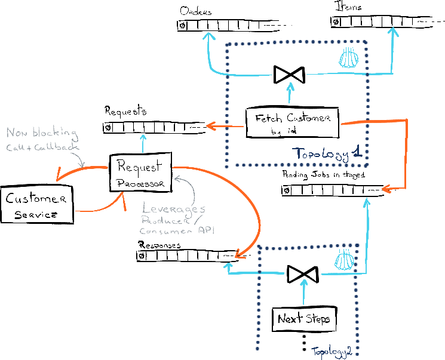

# Kafka side effects processor
## Purpose
If you havee already built a Kafka Streams application and you had to call an external service or database in the middle of one of your topologies, you've probably faced some issues if that call takes too long which can drive your stream processing application in serious troubles and most likely your overall system in some kind of snowball effect. If not (or not yet 😉), your application is prone such issues and you should be aware about that.

The main reason is the following: Kafka Streams is built on top of the Java Kafka client and it comes with the following properties:
- `max.poll.interval.ms = 300000`	
- `max.poll.records = 1000`

And that means that the Kafka client is monitoring the time your application takes to process a batch of records collected with `org.apache.kafka.clients.consumer.KafkaConsumer.poll(java.time.Duration)` and if it takes more than `max.poll.interval.ms`, it is assumed that the application may be in trouble and a rebalance is triggered. Thus it means that the current processing of the current records can't be committed, so they're reworked again and again.

And it is something that can happen if you imagine that this external call takes around 1 second, if the current polled batch has 1000 records then you overshoot the `max.poll.interval.ms` limit. For most contexts 1 second is really far from being an acceptable response time, but it turns out that such cases happen in the field much more often than expected.

Obviously a quick fix would be to calibrate the `max.poll.interval.ms` limit to an acceptable value in the context, but it may not be the best option in the long run as it's a static configuration.

Another option is to delegate this external call to another component which would be able to avoid invoking blocking calls during the poll loop, by leveraging asynchronous APIs. This implies to build this component with the Java Kafka client rather than with Kafka Streams as it's necessary to get a better control of what happens in the poll loop. It implies as well to split the topology were the external call is required:
  
 

And **Kafka side effects processor** is a possible implementation for that purpose.

## How to use it

Kafka side effect processor is expected to be used as a dependency in a project in which a Java class with a main method will be used to build the processor depending on your context. Check out [blep.MainHttpExample](src/test/java/blep/MainHttpExample.java) to see how to set a processor up. 

Retry policy can be selected among available [blep.RetryPolicy](src/main/java/blep/RetryPolicy.java) implementation or you can provide your own one.

This library is shipped with the ability to handle HTTP requests but you can provide your own external call request processing by providing the implementation for `blep.SideEffectProcessor.AsyncPayloadProcessor`, `blep.SideEffectProcessor.ReturnedValueChecker` and serializers/deserializers, which could be a way to query a database or run an intense computation without puting the upstream stream processing applicationin trouble. 

      